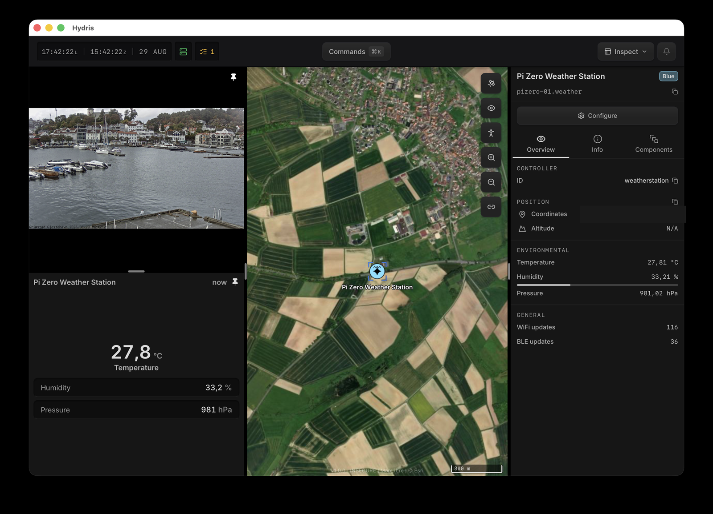

# Pi Zero BME280 Environment Monitor

A lightweight IoT environmental monitoring system for Raspberry Pi Zero. Collects temperature, humidity, and barometric pressure data from a BME280 sensor, displays it on a real-time web dashboard, and can publish into a [Hydris](https://github.com/projectqai/hydris) engine over WiFi (gRPC) and BLE (GATT peripheral).


## Features

- **Real-time monitoring** - Temperature, humidity, and pressure readings every 10 seconds
- **Interactive charts** - Drag-to-zoom, scroll zoom, and pan functionality
- **Time range selection** - View data from 1 hour to 30 days
- **Persistent storage** - SQLite database survives reboots
- **Auto-start service** - Runs automatically on boot via systemd
- **Mobile-friendly** - Responsive design works on phones and tablets
- **Low power** - Runs on Pi Zero 2 W with ~150mA draw
- **Hydris publishing** - Optional gRPC push into a Hydris engine over WiFi
- **BLE GATT peripheral** - Optional standard Environmental Sensing Service, consumed by the [hydris-weather-ble-plugin](https://github.com/jonas-theobald/hydris-weather-ble-plugin) hub plugin
- **USB provisioning** - Plug the Pi into a laptop running Hydris and configure it from the UI (WiFi, Hydris settings, identify LED) — see [docs/PROVISIONING.md](docs/PROVISIONING.md)

## Hardware Requirements

| Component | Notes |
|-----------|-------|
| Raspberry Pi Zero W/WH/2W/2WH | Any WiFi-enabled Pi Zero |
| BME280 sensor module | I2C version (4-pin) |
| MicroSD card | 8GB+ recommended |
| Female-to-female jumper wires | 4 wires needed |
| 5V power supply | 2A recommended |

## Wiring Diagram

```
BME280          Raspberry Pi Zero
┌──────┐        ┌─────────────────┐
│ VIN  │────────│ Pin 1  (3.3V)   │
│ GND  │────────│ Pin 6  (GND)    │
│ SCL  │────────│ Pin 5  (GPIO 3) │
│ SDA  │────────│ Pin 3  (GPIO 2) │
└──────┘        └─────────────────┘
```

## Quick Start

### 1. Prepare the SD Card

1. Download [Raspberry Pi Imager](https://www.raspberrypi.com/software/)
2. Flash **Raspberry Pi OS Lite (32-bit)**
3. Configure WiFi, SSH, and hostname in the settings
4. Insert SD card into Pi and boot

### 2. Enable I2C

```bash
sudo raspi-config
# Interface Options → I2C → Enable
sudo reboot
```

### 3. Install the Project

```bash
# Clone the repository
git clone https://github.com/jonas-theobald/IoT-weather-station.git
cd IoT-weather-station

# Run the install script
chmod +x install.sh
./install.sh
```

### 4. Access the Dashboard

Open in your browser (replace with your Pi's hostname):
```
http://<hostname>.local:5000
```

Or use the Pi's IP address: `http://<PI_IP>:5000`

## Manual Installation

If you prefer to install manually:

```bash
# Create virtual environment
python3 -m venv ~/bme280-env
source ~/bme280-env/bin/activate

# Install dependencies
pip install -r requirements.txt

# Only needed for the BLE peripheral (HYDRIS_BLE=1): bluezero's deps
# won't build in a venv, so use the distro bindings instead
sudo apt install python3-gi python3-dbus
echo /usr/lib/python3/dist-packages > \
  "$(python -c 'import site; print(site.getsitepackages()[0])')/system-gi.pth"
pip install --no-deps bluezero

# Verify sensor connection
sudo i2cdetect -y 1
# Should show 76 or 77

# Test the sensor
python read_bme280.py

# Install and start the service
sudo cp bme280.service /etc/systemd/system/
sudo systemctl daemon-reload
sudo systemctl enable bme280
sudo systemctl start bme280
```

## Project Structure

```
IoT-weather-station/
├── start_all.py            # Main entry point (collector + web server)
├── web_server.py           # Flask web server with dashboard
├── database.py             # SQLite database operations
├── collector.py            # Standalone data collector
├── read_bme280.py          # Simple sensor test script
├── model/
│   └── entity_builder.py   # BME280 reading -> world.proto Entity
├── transport/
│   ├── grpc_wifi.py        # WiFi transport: WorldService.Push over gRPC
│   └── ble_gatt.py         # BLE transport: GATT peripheral (ESS + DIS)
├── routing/
│   └── transport_router.py # Broadcast/failover across transports
├── reliability/
│   └── pending_store.py    # Retry buffer for failed pushes
├── tools/
│   └── simulate_station.py # Push synthetic readings without hardware
├── provisioning/           # USB provisioning: gadget setup + Go agent
│   ├── usb-gadget.sh       # CDC ACM gadget identity (configfs)
│   ├── usb-gadget.service
│   ├── pi-provision.service
│   └── agent/              # Go: framed world.proto RPC on /dev/ttyGS0
├── tests/                  # Wire-format and entity tests
├── docs/
│   ├── HYDRIS_INTEGRATION.md  # Architecture, entity model, BLE gotchas
│   └── WIRING.md
├── bme280.service          # Systemd service definition
├── install.sh              # Automated installation script
└── requirements.txt        # Python dependencies
```

## Configuration

### Change Sensor Reading Interval

Set the `HYDRIS_INTERVAL` environment variable (seconds, default 10) —
via the systemd drop-in, or simply from the Hydris provisioning form.

### Change Web Dashboard Refresh Rate

Edit `web_server.py`, find this line:
```javascript
setInterval(updateData, 10000);  // milliseconds
```

### Change Sensor I2C Address

Most BME280 modules use `0x76` or `0x77`. The code auto-detects, but you can force an address in `start_all.py`:
```python
sensor = create_sensor(address=0x77)
```

## Hydris Integration (optional)

If no Hydris variable is set, the station runs standalone and none of this is active. Configuration is via environment variables, typically a systemd drop-in:

```bash
sudo systemctl edit bme280
```

```ini
[Service]
Environment=HYDRIS_SERVER=<engine-host>:50051
Environment=HYDRIS_BLE=1
```

| Variable | Default | Purpose |
|---|---|---|
| `HYDRIS_SERVER` | unset | Engine address for the WiFi/gRPC push (`host:port`) |
| `HYDRIS_BLE` | unset | `1` enables the BLE GATT peripheral |
| `HYDRIS_BLE_NAME` | `hydris-weather` | Advertised BLE local name |
| `HYDRIS_ENTITY_ID` | `pizero-01.weather` | Entity id in the Hydris world model |
| `HYDRIS_LABEL` | `Pi Zero Weather Station` | Entity label |
| `HYDRIS_INTERVAL` | `10` | Sensor reading interval in seconds |

All of these can also be set from the Hydris UI over a USB cable — see [docs/PROVISIONING.md](docs/PROVISIONING.md).

There is deliberately no position configuration: the station never pushes `geo`. Place it on the map in Hydris — that placement persists.

Both transports feed the **same entity**. The BLE side is consumed by the [hydris-weather-ble-plugin](https://github.com/jonas-theobald/hydris-weather-ble-plugin) running in the engine; it adds the RSSI link and keys identity on the Pi's SoC serial. Architecture, the entity model, the GATT contract, and the hard-won BLE gotchas (kernel advertising bug and friends) are in [docs/HYDRIS_INTEGRATION.md](docs/HYDRIS_INTEGRATION.md).

This is what it looks like once everything is running:



The station is a first-class entity in Hydris: placed on the map by the operator, MIL-STD-2525 symbol derived from its taxonomy, live readings in the entity panel, and both transports reporting side by side ("WiFi updates" / "BLE updates"). The setup works as a reference integration for small sensor hardware in general — a sensor node that speaks gRPC and/or a slim GATT contract, plus a small hub plugin, is all it takes to put hardware on a Hydris map.

Test the engine path without hardware:
```bash
python tools/simulate_station.py --server localhost:50051
```

## Service Management

```bash
# Check status
sudo systemctl status bme280

# View logs
journalctl -u bme280 -f

# Restart service
sudo systemctl restart bme280

# Stop service
sudo systemctl stop bme280

# Disable auto-start
sudo systemctl disable bme280
```

## API Endpoints

| Endpoint | Description |
|----------|-------------|
| `GET /` | Web dashboard |
| `GET /api/readings?hours=24` | JSON data for the last N hours |

### Example API Response

```json
{
  "latest": {
    "timestamp": "2026-01-16T18:30:00",
    "temperature": 23.5,
    "humidity": 45.2,
    "pressure": 1013.25
  },
  "history": [
    {"timestamp": "...", "temperature": 23.4, "humidity": 45.0, "pressure": 1013.20},
    ...
  ]
}
```

## Troubleshooting

| Problem | Solution |
|---------|----------|
| `i2cdetect` shows nothing | Check wiring, ensure I2C is enabled |
| Address is `0x77` not `0x76` | Code auto-detects; no action needed |
| Permission denied | Run: `sudo usermod -aG i2c $USER` then reboot |
| Service won't start | Check logs: `journalctl -u bme280 -e` |
| Dashboard not loading | Verify service is running: `systemctl status bme280` |
| Can't access from network | Check firewall: `sudo ufw allow 5000` |
| BLE not advertising / hub can't see the station | See the BLE gotchas in [docs/HYDRIS_INTEGRATION.md](docs/HYDRIS_INTEGRATION.md) — some Pi kernels need the `btmgmt` advertising workaround |

## Storage Requirements

- Each reading: ~50 bytes
- Per day (10s interval): ~432 KB
- Per year: ~158 MB
- 16GB SD card: **~100 years** of data

## Power Consumption

| Component | Current |
|-----------|---------|
| Pi Zero 2 W (idle + WiFi) | ~100-150 mA |
| BME280 sensor | ~1 mA |
| **Total** | ~150 mA |

With a 20,000 mAh battery pack: **~4-5 days** runtime

## License

MIT License - see [LICENSE](LICENSE) file

## Contributing

Pull requests are welcome. For major changes, please open an issue first to discuss what you would like to change.

## Acknowledgments

- [Adafruit CircuitPython BME280](https://github.com/adafruit/Adafruit_CircuitPython_BME280) - Sensor library
- [Chart.js](https://www.chartjs.org/) - Charting library
- [chartjs-plugin-zoom](https://www.chartjs.org/chartjs-plugin-zoom/) - Zoom functionality
